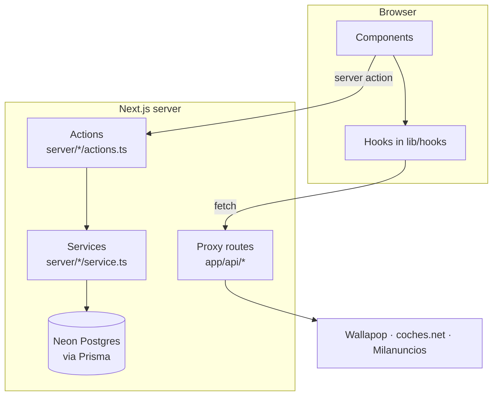
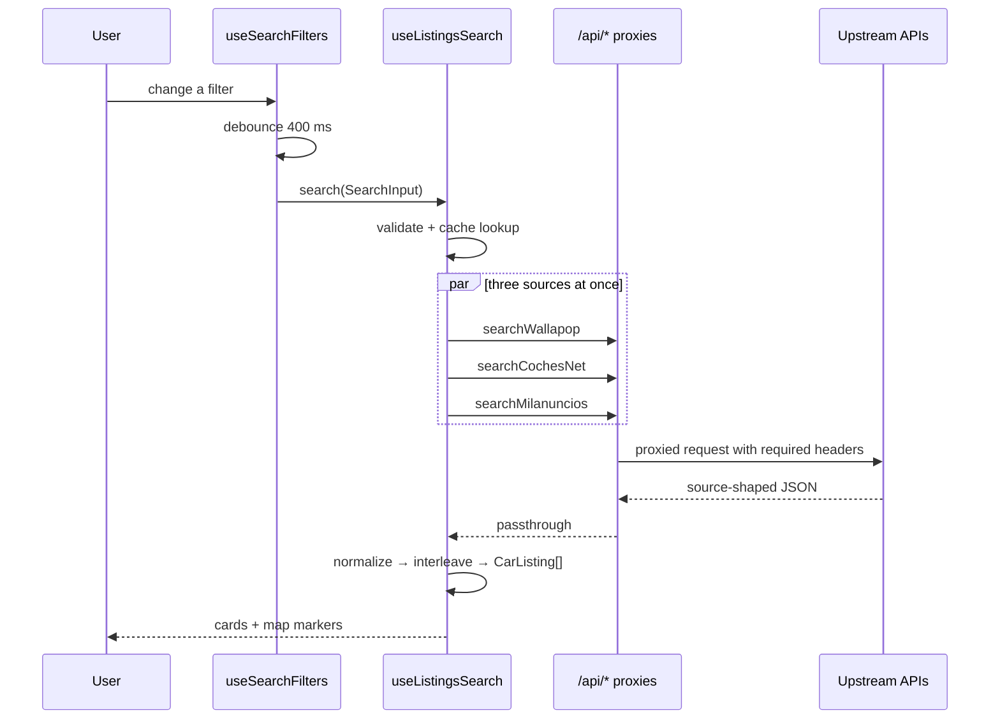
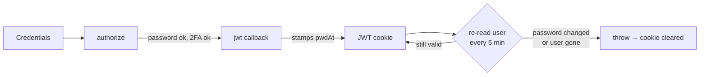
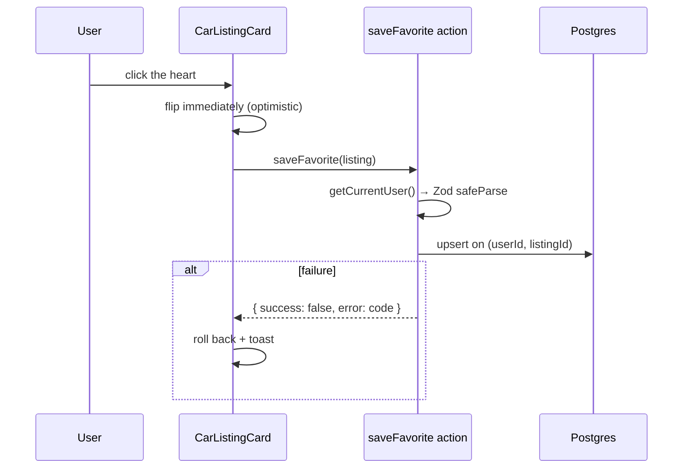
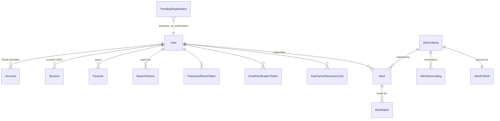
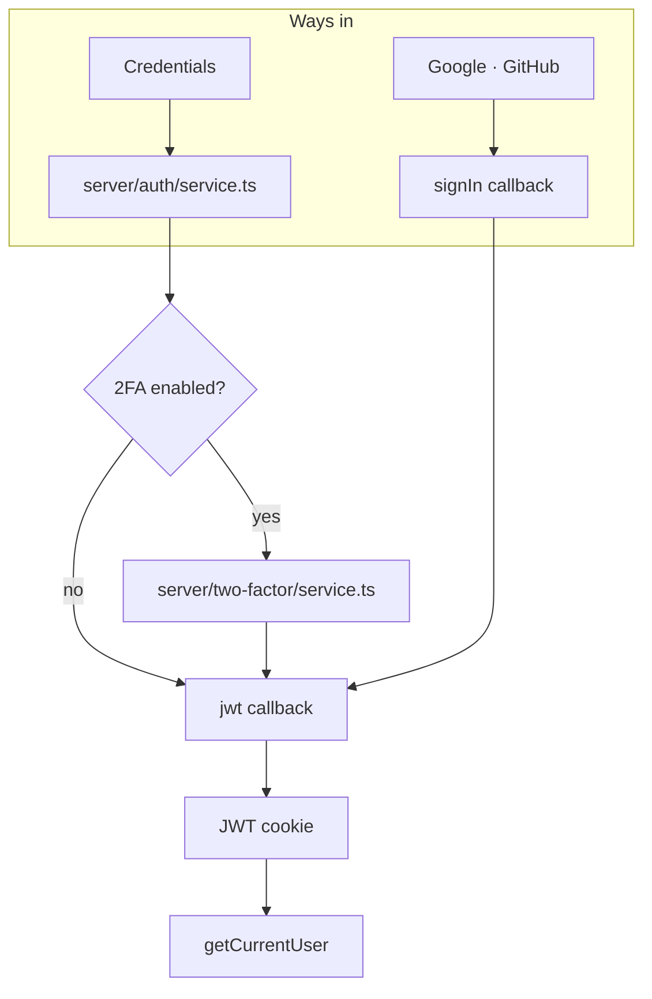

# Architecture

The system in one read: four request paths traced end to end, the patterns that
apply everywhere, then the data model, authentication, the frontend, testing,
and the environments it runs in.

Behaviour guarantees are not here — they live in the specs under
[`specs/`](../README.md#specs) and are enforced by `pnpm spec:check`. This
document explains how the pieces fit, which no single spec owns. Setup and
commands are in the root [README](../README.md#getting-started).

## The shape

A Next.js 16 App Router application. There is no separate backend: server
components, server actions and route handlers all run in the same deployment.



Two rules fall out of that picture and explain most of the code:

- **Components never call `fetch`.** Request lifecycles live in `lib/hooks/*`,
  which call clients in `lib/<source>/*`. A component consumes a hook.
- **Mutations are server actions; route handlers are only for proxying.**
  Anything writing to the database is an action in `server/<feature>/actions.ts`,
  which reaches Prisma only through that feature's `service.ts`
  ([specs/core-layout.md](specs/core-layout.md)). The `app/api/` routes exist
  because the upstream marketplaces cannot be called from a browser.

## Path 1 — a search

The core of the product, and the only path that fans out.



**Filters.** [`lib/hooks/useSearchFilters.ts`](../lib/hooks/useSearchFilters.ts)
holds every filter in one `FilterValues` object and exposes a typed setter per
field. Each setter funnels into `update()`, which patches state and **debounces
the search by 400 ms** — filters re-search as you touch them, so without the
debounce a drag on a range slider would fire a dozen fan-outs.

Two deliberate asymmetries:

- `triggerSearch()` (the search button) searches immediately **and collapses the
  filter panel**. `update()` does not collapse it — closing the panel out from
  under someone still adjusting filters would be hostile.
- `setBrand` also clears `model`. A model id only means anything under its brand.

On mount the hook fires an immediate search using the Spain-centre fallback,
starts browser geolocation, and re-searches when geolocation resolves — but only
if the user has not meanwhile picked an explicit location. Doing it in that order
is what stops the first paint waiting on a permission prompt.

**Fan-out.** [`lib/hooks/useListingsSearch.ts`](../lib/hooks/useListingsSearch.ts)
validates the params with `searchSchema`, checks a 60-second in-memory cache
(`lib/wallapop/cache.ts`, keyed by the JSON-stringified params), then calls all
three sources under `Promise.allSettled`.

**Partial failure is the normal case.** Only if *all three* reject does the user
see an error; otherwise the survivors render. Three reverse-engineered upstreams
means one being unavailable is a Tuesday, not an outage.

Results are merged **round-robin**, not concatenated, so every source appears
near the top instead of whichever returned most dominating the first screen.

**The merge enforces the filters upstream cannot.** Only Wallapop honours the
radius on its side, and only the structured sources honour the model, so the
merged list is post-filtered: with a location chosen, listings outside the
radius — or pinned at the country-centre fallback — are dropped
(`lib/geo/radius.ts`), and with a model selected, listings naming it neither
in their model field nor their title are dropped. The behaviour is owned by
MAP-16..18 in [`specs/map-and-search.md`](specs/map-and-search.md); removing
the post-filter reverts coches.net and Milanuncios to nationwide results.

**Out-of-order responses.** Every call to `search()` increments
`searchVersionRef`, and the result is discarded if the version moved on while it
was in flight. With a 400 ms debounce and three sources of differing latency, a
slow earlier search would otherwise overwrite a fast later one.

**Pagination is per-source**, because the three APIs page differently: Wallapop
returns a `next_page` cursor, the other two take page numbers with a total. The
sentinel calls `loadMore()`, which only re-requests sources that still have more.
`loadMore` is not part of the hook's public surface — it fires from an
`IntersectionObserver` attached via `sentinelRef`, which is also how it has to be
tested.

Because the post-filter above can empty a page, fetching a page and growing the
list are no longer the same event, and both the first search and `loadMore`
keep fetching rounds until one yields a listing or every source is exhausted.
Removing that loop reintroduces a dead end rather than merely a short page —
the reasoning is MAP-19's, in
[`specs/map-and-search.md`](specs/map-and-search.md).

**One shared filter set drives all three sources.** The UI builds a single
`SearchInput`; each client translates it into that API's parameters. There is no
per-source filter UI, and adding one would be the wrong shape — see
[`specs/data-sources.md`](specs/data-sources.md), whose Contracts section records
what each upstream actually does.

## Path 2 — sign-in and revocation

NextAuth 4 with JWT sessions. The interesting part is not signing in; it is
signing *out* a session you cannot delete.



A JWT lives in the browser and cannot be revoked server-side, so
`User.passwordChangedAt` acts as a **revocation clock** the `jwt` callback
checks on every re-read. See
[specs/auth-email-and-oauth.md › Session hardening and revocation](specs/auth-email-and-oauth.md#session-hardening-and-revocation)
for the mechanism.

**`proxy.ts` is UX, not authorization.** Next 16 renamed the `middleware` file
convention to `proxy`. It decodes and signature-checks the JWT, which is enough
to redirect a signed-out visitor away from `/account` or `/favorites` — but it
does **not** run the `jwt` callback, so it cannot see revocations. Every server
action independently calls `getCurrentUser()` from
[`lib/auth/session.ts`](../lib/auth/session.ts), which does.

**Never call `getServerSession` directly.** `getCurrentUser()` is the only
authorization check that honours revocation.

The rest — password policy, enumeration resistance, 2FA, email flows — is
specified in [`specs/auth-email-and-oauth.md`](specs/auth-email-and-oauth.md);
the orientation is under [Authentication](#authentication) below.

## Path 3 — a favorite

The one path that writes from a user request, and the template for future
mutations.



[`server/favorites/actions.ts`](../server/favorites/actions.ts) is the shape every
server action follows, with its database work in
[`server/favorites/service.ts`](../server/favorites/service.ts):

1. `getCurrentUser()` **first** — before validation, before any query.
2. Zod `safeParse` on the input.
3. Return `{ success, error?: Code }` where the error is a **code**, never prose.
4. Catch and map failures to `unexpected`; never leak the exception.

Three decisions in there worth knowing, each with a reason that is not obvious
from the code:

- **`upsert` with `update: {}`.** Saving is a toggle, so a second click on an
  already-saved listing is an ordinary event rather than an error to recover
  from. The empty update deliberately leaves the original snapshot alone —
  re-saving is not a refresh, and silently rewriting the stored price would make
  staleness harder to reason about, not easier.
- **`removeFavorite` reports success even when nothing matched.** The caller
  asked for the listing not to be saved, and it is not saved. Distinguishing
  "removed" from "was never yours" would confirm that someone else's favorite
  exists.
- **Favorites store a full snapshot, not a reference.** No source client can
  fetch a single listing by id, so a reference-only favorite would have nothing
  to render. The trade-off — the snapshot goes stale — is argued in
  [`specs/favorites.md`](specs/favorites.md).

**Reconciliation.** The sources know nothing about this user, so the saved set is
joined on the client: `useFavorites` fetches the saved ids once per session and
`MapView` passes `isFavorite` into every card. This was a real bug — cards
rendered without the prop, so a saved car came back from a search looking
unsaved, while the component test passed because it supplied a prop the
application never did.

## Path 4 — a poll with no user in it

The three paths above all begin with a request. Alerts do not: a GitHub Actions
cron POSTs to `app/api/alerts/run/route.ts`, which authenticates the caller and
hands the run to `server/alerts/service.ts`, which claims work off a Postgres
queue and drains it. Two consequences reshape the rules above rather than
following them.

**It cannot use `lib/*/client.ts`.** Those resolve their URL against
`window.location.origin` and call the proxy routes — which is precisely what the
proxies are for. A cron has neither, so `server/alerts/search.ts` calls the three
upstreams directly with the same headers the proxies send.

**It cannot use `getCurrentUser()`.** The caller is a machine, so the endpoint
authenticates with a shared secret in constant time. This is the one place the
"prefer server actions, route handlers only for proxying" rule does not apply,
because there is no session and no browser to run an action from.

Everything else it needs — locale for the email, the listing snapshot — is read
from the database, because there is no request context to infer it from. Full
behaviour in [`specs/alerts.md`](specs/alerts.md); the scheduling choice and what
it beat in [`decisions/0006-alert-scheduling.md`](decisions/0006-alert-scheduling.md);
running it in [Alerts](#alerts) below.

## Patterns that apply everywhere

**No data-fetching library.** There is no TanStack Query, SWR or Redux, and
adding one is a decision to raise rather than make. Hooks own their own request
lifecycle, including the out-of-order guard.

**Errors are codes, not messages.** Server code cannot read the client i18n
context and the default locale is Spanish, so actions and Zod schemas return
codes (`AUTH_ERROR`, `FAVORITE_ERROR`). Forms resolve them at render with
`translateAuthError(t, code)` from [`lib/i18n/errors.ts`](../lib/i18n/errors.ts).
When calling `setError`, pass the raw code — the field translates it once.

**Failures surface as toasts**, not inline error text — except field-level
validation, which is inline and focuses the first error.

**Configuration is validated at boot.** [`lib/env.ts`](../lib/env.ts) parses
`process.env` with Zod at import time and throws with a readable message. Two
variables are required; everything else disables a feature rather than blocking
startup ([Environment variables](#environment-variables)).

**Everything user-facing goes through `t.*` keys** in both locales. No hardcoded
Spanish or English in components.

## Directory map

| Path | Holds |
| --- | --- |
| `app/` | Routes, layouts, proxy route handlers |
| `server/<feature>/` | The server layer, one folder per feature: `actions.ts` (Server Actions — every mutation), `queries.ts` (page reads), `service.ts` (the only files that import Prisma, apart from `lib/db/` and the LAYOUT-7 exception, `lib/auth/options.ts` until phase 11 — see [specs/core-layout.md](specs/core-layout.md)), `schema.ts` (Zod schemas with exported inferred types). Boundaries enforced by dependency-cruiser — see [specs/core-layout.md](specs/core-layout.md) |
| `app/api/` | Proxy route handlers for the three upstreams, plus the alert cron endpoint |
| `components/map/` | The search + map feature |
| `components/ui/` | Radix-wrapped primitives |
| `lib/hooks/` | Every request lifecycle |
| `lib/wallapop/`, `lib/cochesnet/`, `lib/milanuncios/` | One module per source: client, normalize, taxonomy |
| `lib/auth/` | Session, password policy, tokens, two-factor |
| `lib/i18n/` | Locale resolution, translations, error-code copy |
| `lib/geo/` | Static cities, Nominatim geocoding, browser geolocation |
| `lib/db/` | The Prisma client module, the only one outside `server/**/service.ts` that reaches the database, apart from the LAYOUT-7 exception, `lib/auth/options.ts` until phase 11 (see [specs/core-layout.md](specs/core-layout.md)) |
| `lib/listings/` | The pure search-merge logic: interleaving, the radius and model post-filters, the page-state advance |
| `lib/search/` | The `SearchInput` Zod schema every source translates from, until phase 9 moves the search to the server |
| `interfaces/` | Reusable typings — `CarListing`, `SelectedLocation`, `AlertSummary` |
| `scripts/` | Tooling: branch databases, spec, docs and TODO checks — dependency-free except the TODO check, which loads `typescript` |

`app/generated/prisma/` is generated and gitignored.

## Data model

Seventeen models in [`prisma/schema.prisma`](../prisma/schema.prisma), on Neon
Postgres, reached through Prisma 7's `@prisma/adapter-pg` driver adapter. Which
fields hold personal data, and for how long, is in
[`privacy/data-inventory.md`](privacy/data-inventory.md).

One thing is **not** modelled and should not be assumed: normalised `Car`
listing storage. Listings are fetched live on every search and persisted only as
snapshots — on `Favorite` when someone saves one, and on `AlertMatch` when a
poll discovers one.

### Conventions

Every model follows the same conventions, decided in
[`specs/core-data-model.md`](specs/core-data-model.md) and recorded in
[ADR 0015](decisions/0015-data-model-conventions.md):

- **Ids are UUIDv7** (`id String @id @default(uuid(7)) @db.Uuid`), not `cuid()`, so they still sort
  in creation order. Every foreign key is `@db.Uuid` to match — except `Favorite.listingId`,
  `AlertSeenListing.listingId`, `AlertMatch.listingId` and `Account.providerAccountId`, which end in
  `Id` but are not foreign keys into this schema (an external listing id, an OAuth provider's own
  user id) and stay plain `String`.
- **Tables and multi-word columns are snake_case** (`@@map`/`@map`), TypeScript names unchanged —
  `AlertPollJob` → `alert_poll_jobs`, `createdAt` → `created_at`.
- **Every `DateTime` is `@db.Timestamptz(3)`**, not `timestamp` without time zone.
- **Every model carries six standard columns**: `createdAt`, `updatedAt`, `createdById`,
  `updatedById` (nullable FKs to `User`, null for system writes), `deletedAt` and
  `version Int @default(1)`. Unused on a given model (`deletedAt` on `RateLimit`, `createdById` on
  a cron-only row), they still exist, for uniformity.
- **Soft delete, not hard delete, for `Favorite` and `Alert`.** Deleting either sets `deletedAt`
  instead of removing the row; every read excludes it through `notDeleted` (`lib/db/soft-delete.ts`).
  Saving over a soft-deleted row restores it (clears `deletedAt`, bumps `version`) rather than
  failing on the unique constraint. `server/retention/service.ts`'s `purgeSoftDeletedRows` erases
  rows **30 days** after `deletedAt`, called from the same opportunistic paths that already prune
  expired auth rows — no new scheduler. Account deletion is unaffected: it still erases at once.
- **Optimistic locking on the two user-editable `User` forms.** `updateProfile` and
  `changePassword` assert the `version` the form rendered and increment it in one `updateMany`; a
  mismatch returns the `conflict` error code instead of silently overwriting a concurrent edit.
- **`onDelete: Cascade` only where the child is meaningless without its parent**, each with a
  one-line comment saying why; every other relation is `Restrict`.

### The models



#### User

The account. `password` is **nullable** — OAuth-only accounts never set one, so
credentials login must guard on it (`server/auth/service.ts`).

`image`, not `avatarUrl`: the NextAuth Prisma adapter writes the OAuth profile
picture to that exact field name, and renaming it breaks linking silently.

Four fields exist purely to make security properties work:

| Field | Job |
| --- | --- |
| `passwordChangedAt` | The revocation clock the `jwt` callback checks against every token — see [specs/auth-email-and-oauth.md › Session hardening and revocation](specs/auth-email-and-oauth.md#session-hardening-and-revocation) |
| `twoFactorSecret` | AES-256-GCM ciphertext, **not a hash** — verifying a TOTP code means recomputing the HMAC, so the secret must be recoverable. The key is `TWO_FACTOR_ENCRYPTION_KEY`, so the database alone is not enough |
| `twoFactorEnabledAt` | Null while enrolment is half-finished. **Only this field gates login**, which is what stops a user locking themselves out mid-setup |
| `twoFactorLastStep` | Highest accepted TOTP counter step. Anything at or below it is refused, so a code read over a shoulder cannot be replayed inside its own 30-second window |

#### Favorite

A saved listing, stored as a **full snapshot** of `CarListing` rather than a
reference. Fourteen denormalised columns: `source`, `title`, `subtitle`, `image`,
`brand`, `model`, `location`, `fuel`, `url`, `price`, `mileage`, `year`, `lat`,
`lng`.

That looks wrong until you know that no source client can fetch a single listing
by id — all three expose search only — so a `(source, listingId)` row would have
nothing to render. The trade-off, and the alternative it beat, is argued in
[`specs/favorites.md`](specs/favorites.md).

`listingId` is the normalised, source-prefixed id (`wallapop-abc123`), already
unique across sources, so no separate source column is needed as a key.

`@@unique([userId, listingId])` is what makes "saving twice leaves one row" true
**in the database** rather than in a read-then-write race in application code —
the control is a toggle a user can click twice in a second.

#### Auth tokens

Three token tables, all following the same rule: **the raw token is never
stored.** Only a SHA-256 digest, so a database leak does not hand an attacker
working links.

| Model | Backs |
| --- | --- |
| `PasswordResetToken` | `/forgot-password` → `/reset-password?token=` |
| `EmailVerificationToken` | `newEmail == null` confirms the current address; `newEmail != null` moves the account to that address on redemption |
| `PendingRegistration` | A submitted-but-unconfirmed signup |

All are single-use via `usedAt` and expire via `expiresAt`.

**`PendingRegistration` is the one that matters most.** No `User` row exists until
someone proves control of the address, which is what lets the signup form answer
"check your inbox" identically whether or not the email is already taken. It
holds the bcrypt hash, never the plaintext, so confirmation does not have to ask
for the password again.

#### TwoFactorRecoveryCode

SHA-256, not bcrypt. The codes carry ~73 bits of entropy so there is no
dictionary to grind, and a unique index makes redemption one indexed lookup
instead of ten slow comparisons.

They exist because password reset deliberately does **not** bypass 2FA — if it
did, control of the mailbox would defeat the second factor entirely — so without
recovery codes a lost phone is a lost account.

#### RateLimit

Fixed-window counters, keyed by `key`. In Postgres rather than memory because
Vercel runs each request on a possibly-cold instance, so an in-process `Map`
would reset constantly and limit nothing.

#### Adapter-required models

`Account`, `Session` and `VerificationToken` exist because
`@next-auth/prisma-adapter` requires them.

**`Session` is dead while the strategy is JWT** — nothing writes to it — but the
adapter's type contract needs the model to exist. `VerificationToken` is likewise
the adapter's own magic-link table, distinct from our `EmailVerificationToken`.

#### The six alert models

Behaviour and reasoning: [`specs/alerts.md`](specs/alerts.md). Each of the six
holds a distinct lifetime and access pattern — a criteria set shared by every
subscriber, a per-user subscription, a per-listing seen-memory, a per-discovery
delivery snapshot, a queue row, and global source health — so collapsing any
pair would conflate concerns with different cascade and retention rules. See
[specs/alerts.md › Data model](specs/alerts.md#data-model).

`AlertCriteria`'s hash of the canonicalised criteria is the property the
upstream request budget depends on. `AlertMatch` stores a full snapshot for the
same reason `Favorite` does: no source client can fetch a single listing by id.

`User.locale` was added alongside these. It exists because the alert runner is a
cron with no request to resolve a locale from, and the default is `es` — without
it every English-speaking user would be mailed in Spanish.

#### SearchHistory

`userId`, `query`, `createdAt`. Present but not yet surfaced anywhere.

### Cascades

Every user-owned model uses `onDelete: Cascade`, so deleting a `User` removes
their favorites, alerts, tokens, recovery codes, OAuth links and search history.
Deleting an `AlertCriteria` takes its seen-list and queue row with it, which is
what makes releasing an unsubscribed criteria set a single delete. What account
deletion leaves behind is in [`privacy/deletion.md`](privacy/deletion.md).

This is a **schema property enforced by Postgres, not by application code**, and
no Vitest test in this repo can prove it — Prisma is mocked, so a test would only
assert that Prisma was called with the right arguments. It is verified by review
and by the database-backed e2e suite.

### Migrations

Standard Prisma, with one project-specific rule that is not optional.

#### Run `pnpm db:branch` first, from any worktree

`prisma migrate dev` assumes the dev database matches the **current branch's**
migration history. While worktrees share one database, a migration applied from
any one of them makes every other worktree report "applied to the database but
missing from the local migrations directory" — and the only remedy Prisma offers
is a reset that drops every row.

The database holds real accounts and there is no seed script.

**Never run `prisma migrate reset`, `db push --force-reset`, or anything that
drops the database.** Prisma offers it for bookkeeping problems that do not need
it. Treat the offer as a bug report, not an instruction.

`scripts/require-branch-db.mjs` enforces this rather than trusting anyone to
remember — see [Refusing to run](../README.md#refusing-to-run).

#### Two traps

- **`prisma migrate status` does not catch drift.** It reported "Database schema
  is up to date!" against a stale checksum *and* a migration missing locally. It
  validates neither. Only `migrate dev` does.
- **Checksums are SHA-256 of `migration.sql` with CRLF normalised to LF.** On a
  checkout with `core.autocrlf=true` (the Git for Windows default), migration
  files stay CRLF on disk and LF in git, because `.gitattributes` has no rule
  for `prisma/migrations/`. That is **not** a source of drift. Do not chase it.
  The only rule `.gitattributes` does carry is `.husky/* text eol=lf`, which
  keeps the Git hooks LF so knip reads `lint-staged` cleanly.

#### Repairing a stale checksum

```sql
UPDATE _prisma_migrations SET checksum = … WHERE migration_name = …
```

Never a reset. Confirm the file is semantically correct first: if `migrate dev`'s
drift summary shows no differences attributable to that migration, Prisma already
replayed it on a shadow database and it matched.

## Authentication

**This section is deliberately short.**
[`specs/auth-email-and-oauth.md`](specs/auth-email-and-oauth.md) covers
authentication in full and is enforced by `spec:check`. Writing a second,
unenforced account of the same system is the most likely way this documentation
ends up confidently wrong.

So: the map, the threat model in a paragraph, and where to read next.

### The pieces



| Area | Lives in |
| --- | --- |
| NextAuth config, callbacks, providers | `lib/auth/options.ts` |
| Credentials verification | `server/auth/service.ts` — `authorizeCredentials()` |
| The only authorization check | `lib/auth/session.ts` — `getCurrentUser()` |
| Password rules | `lib/auth/password-policy.ts`, `password-strength.ts`, `pwned.ts` |
| Hashing | `lib/auth/hash.ts` — bcryptjs, 12 rounds |
| Tokens | `lib/auth/tokens.ts` — SHA-256, single-use |
| TOTP | `lib/auth/two-factor/` — built on `node:crypto`, no dependency |
| Rate limiting | `server/rate-limit/service.ts` — Postgres-backed |
| Route redirects | `proxy.ts` |
| Email | `lib/email/` — Resend over `fetch` |

### The threat model in a paragraph

The account is worth taking, so every surface is **enumeration-resistant**:
identical responses whether or not an address exists, bcrypt run *before* any
existence check so timing cannot substitute for the message, and registration
that writes a `PendingRegistration` rather than a `User` until the inbox is
proven. Passwords are gated by length and blocklists rather than composition
rules (NIST SP 800-63B), with the breach check **failing open** so an outage
cannot block signups. Sessions are stateless JWTs, revoked off the
`passwordChangedAt` clock (see
[specs/auth-email-and-oauth.md › Session hardening and revocation](specs/auth-email-and-oauth.md#session-hardening-and-revocation)).
TOTP secrets are
*encrypted*, not hashed, because verification recomputes the HMAC — which means
`TWO_FACTOR_ENCRYPTION_KEY` is the thing a database leak alone does not give up.

### Rules that are easy to break

The defences a plausible-looking change can quietly remove are listed in
[specs/auth-email-and-oauth.md › Cross-cutting conventions (do not violate)](specs/auth-email-and-oauth.md#cross-cutting-conventions-do-not-violate),
its [Permissions](specs/auth-email-and-oauth.md#permissions) section — a
password reset leaves two-factor enrolment intact (AUTH-11), and an email
change goes to the new address with the current password required to start it
(AUTH-13) — and its
[Session hardening and revocation](specs/auth-email-and-oauth.md#session-hardening-and-revocation)
subsection, which bumping `passwordChangedAt` depends on.

### Read next

| For | Go to |
| --- | --- |
| Everything: policy, flows, 2FA, OAuth linking, enumeration | [`specs/auth-email-and-oauth.md`](specs/auth-email-and-oauth.md) |
| What the token tables defend against | [Auth tokens](#auth-tokens) |
| Sign-in and revocation as a request path | [Path 2](#path-2--sign-in-and-revocation) |
| Configuring email, OAuth and 2FA | [Environment variables](#environment-variables) |
| Lockouts and undelivered email | [Runbooks](#runbooks) |

## Frontend

The map feature's structure, the design system, internationalisation and
theming. Search *behaviour* — the fan-out, debounce and pagination — is
[Path 1](#path-1--a-search) above and specified in
[`specs/map-and-search.md`](specs/map-and-search.md); locale, geography and theme
behaviour in [`specs/cross-cutting.md`](specs/cross-cutting.md).

### The map feature

Everything lives under `/map` and is orchestrated by
[`components/map/MapView.tsx`](../components/map/MapView.tsx), which composes two
hooks — `useListingsSearch()` for results and `useSearchFilters()` for filter
state — and renders a listings panel beside the map.

```
MapView
├─ ListingsHeader          keyword input + filters toggle
│  └─ SearchFilters        motion.div expand/collapse
│     ├─ LocationSearch    Nominatim autocomplete
│     ├─ ToggleChip ×n     fuel, transmission
│     ├─ RangeInput ×4     price, mileage, year, horsepower
│     └─ Select ×2         brand, model
├─ CarListingCard ×n       + SourceBadge, favorite toggle
├─ ListingsMap             dynamic, ssr: false
└─ MobileMapOverlay        the map, full-screen, on small viewports
```

**`ListingsMap` is loaded via `next/dynamic` with `ssr: false`.** Leaflet needs
the DOM and will not survive server rendering. It switches CARTO tiles by theme,
drops amber `divIcon` markers, and auto-fits bounds to the current listings via a
`FitBounds` child using `useMap()`.

Consequences for tests: mock `react-leaflet` in component tests and render it for
real only in Playwright — see [Environment gotchas](#environment-gotchas).

**Filter option constants** live in `components/map/search-filter-options.ts`.
Labels are resolved through i18n keys, never from the raw constant strings.

**`SearchFiltersProps` is exported** from `SearchFilters.tsx` and threaded
through `MapView`. Adding a filter means updating both — keep the prop names in
sync.

### UI primitives

`components/ui/` wraps Radix primitives: `button`, `card`, `input`, `label`,
`select`, `separator`, plus two with real behaviour of their own —
`range-input` and `toggle-chip`.

Composition uses `class-variance-authority` with `clsx` and `tailwind-merge`; the
`cn` helper is in `lib/utils.ts`.

**`RangeInput` is controlled.** A value only accumulates if a parent holds state.

**Icons are never raw SVG.** Lucide React for UI icons, React Icons for brand
icons. Size with Tailwind (`h-4 w-4`). Icon-only buttons need a descriptive
`aria-label`.

### Design system — Cartographic Modern

Dark-first, inspired by night maps: warm amber on deep ink. Defined in
[`app/globals.css`](../app/globals.css), where `:root` is the **dark** theme and
`.light` is warm paper. Live references at `/palette` and `/typography`.

| Token | OKLCH (dark) | Hex | Used for |
| --- | --- | --- | --- |
| `--background` | `oklch(0.16 0.015 250)` | #0F1419 | Deep ink — app background |
| `--card` | `oklch(0.20 0.015 250)` | #1C2128 | Elevated surfaces |
| `--popover` | `oklch(0.22 0.015 250)` | #262D36 | Panels, dropdowns |
| `--primary` | `oklch(0.75 0.14 75)` | #E8A849 | Amber — CTAs, highlights, markers |
| `--accent` | `oklch(0.62 0.12 160)` | #3B9B6D | Eucalyptus — success, available |
| `--destructive` | `oklch(0.58 0.18 25)` | #D94F4F | Muted red — alerts, price drops |
| `--border` | `oklch(0.28 0.01 250)` | #30363D | Structure, dividers |
| `--foreground` | `oklch(0.92 0.01 250)` | #E6EDF3 | Primary text (cream) |
| `--muted-foreground` | `oklch(0.62 0.01 250)` | #8B949E | Secondary text, metadata |

Semantic aliases also exist: `--success`, `--warning`, `--info`, and
`--chart-1..5`.

The light theme is **not** a mechanical inversion — `--primary` darkens to
`oklch(0.65 0.16 75)` for contrast on paper. Adding a token means adding both.

**Semantic usage.** Primary (amber) for CTAs, selected states, active markers and
favorited highlights. Accent (eucalyptus) for available badges, price decreases
and success. Destructive for errors, sparingly.

#### Typography

Two fonts, loaded via `next/font/google` in `app/layout.tsx` and exposed as CSS
variables:

- **Plus Jakarta Sans** (`--font-sans`) — all UI text
- **JetBrains Mono** (`--font-mono`) — prices, mileage, ids, any compared number

```jsx
<h1 className="text-5xl font-extrabold tracking-tight">BuyCarMap</h1>
<span className="font-mono text-xl text-primary">€14,500</span>
<span className="text-sm text-muted-foreground">45,230 km</span>
```

Use `font-variant-numeric: tabular-nums` for numbers that are compared down a
column.

### Theming

`next-themes` with `attribute="class"`, dark by default, `.light` for light.

**Any component calling `useTheme` must wait for `mounted`**
(`lib/hooks/useMounted.ts`) or it will hydrate mismatched. Use CSS variables
(`var(--…)`) for theme-aware styles rather than branching in JS.

**The theme toggle goes through `lib/hooks/useThemeTransition.ts`**, not
`setTheme` directly. It drives the View Transitions API — an expanding-circle
`clip-path` from the click point. jsdom does not implement View Transitions, so
this is Playwright territory if anywhere.

Map tiles switch with `useTheme().resolvedTheme`:

- Dark — `https://{s}.basemaps.cartocdn.com/dark_all/{z}/{x}/{y}{r}.png`
- Light — `https://{s}.basemaps.cartocdn.com/rastertiles/voyager/{z}/{x}/{y}{r}.png`

### Animation

Motion (`motion/react-client`, with `AnimatePresence` from `motion/react`) rather
than CSS animations for React components.

**Reuse the presets in [`lib/animations.ts`](../lib/animations.ts)** —
`fadeInUp`, `fadeInDown`, `dropdownReveal`, `crossFade`, `fadeIn(delay)`,
`staggerContainer(delay)`, `buttonTap`
— instead of re-declaring `initial`/`animate` inline.

Animate only `transform` and `opacity`. Never animate layout properties, and
never `transition: all`. Honour `prefers-reduced-motion`.

`dropdownReveal` (fade with a 4 px vertical offset in and out, `duration.fast`)
and `crossFade` (fade, `duration.fast`) are the owner-approved presets for
popover content (2026-09-28).

### Internationalisation

Two locales, `en` and `es`. **The default is `es`** — a detail that has caused
real bugs, because hardcoded English strings reach most users.

Config in [`lib/i18n/config.ts`](../lib/i18n/config.ts): `LOCALES`,
`DEFAULT_LOCALE`, `COOKIE_NAME = "locale"`.

**Server.** `getLocale()` reads the `locale` cookie, then falls back to
`Accept-Language`, then the default. `getTranslations()` is used in `layout.tsx`
for metadata and SSR.

**Client.** `I18nProvider` wraps the app; `useTranslation()` returns
`{ locale, t, setLocale, isPending }`. `setLocale` writes a one-year cookie and
`router.refresh()`es inside a transition, so switching language does not blank
the page.

**All user-facing text must use `t.*` keys.** No hardcoded English or Spanish in
components. New keys go in `lib/i18n/locales/en.ts`, `es.ts` **and**
`lib/i18n/types.ts`.

Key parity is enforced by the compiler, not by a test: both locale files are
typed `: Translations`, so a missing key fails the build.

Errors reach the UI as codes and are translated at render — see
[Patterns that apply everywhere](#patterns-that-apply-everywhere).

### UI quality bar

The full MUST/SHOULD/NEVER list is in [`RULES.md`](../RULES.md) §19. The ones most
often missed here:

- Visible focus rings; never `outline: none` without a replacement.
- Hit targets ≥24 px, ≥44 px on mobile. Mobile `<input>` font-size ≥16 px.
- URL reflects state — filters, tabs and pagination should be deep-linkable.
- `<a>`/`<Link>` for navigation, never `<div onClick>`.
- Skeletons mirror the final content so nothing shifts.
- Long content needs `truncate`/`line-clamp-*`/`break-words`, and flex children
  need `min-w-0` before they will truncate at all.
- Redundant status cues — never colour alone.

## Testing

**Vitest** (unit, node, integration, component), **React Testing Library**, **MSW** for network,
**Testcontainers** for the real Postgres the integration project runs against, **vitest-axe** for
accessibility, **Playwright** for end-to-end and visual. This is the house setup — do not
introduce Jest or Cypress.

Tests are **colocated**: `foo.ts` → `foo.test.ts`. There are no `__tests__/`
folders.

### The six levels

Choosing the level is a decision made in the spec, not an afterthought. Pushing
work down a level is almost always right.

| Level | Runs in | Named | For |
| --- | --- | --- | --- |
| `unit` | jsdom | `*.test.ts` | Pure library code, source clients (they need `window.location`) |
| `component` | jsdom | `*.test.tsx` | Rendering and interaction, via Testing Library |
| `node` | node | `*.node.test.ts` | Route handlers, server actions, scripts — anything needing real Node request globals, no database |
| `integration` | node, real Postgres | `*.integration.test.ts` | The same, plus anything that reads or writes through `@/lib/db/prisma` |
| `contract` | node | `test/contract/*.contract.test.ts` | The shape of the **external** APIs |
| `e2e` | browser | `e2e/*.spec.ts` | Only what genuinely needs a browser |

#### The three Vitest projects

Split by environment, not by kind — see [`vitest.config.ts`](../vitest.config.ts).

**`unit`** (jsdom) is the default: everything under `lib/`, `components/`,
`app/` and `server/` matching `*.test.{ts,tsx}`.

**`node`** is opt-in **by filename**: `*.node.test.ts`. Route handlers and server
actions need Node's real `Request`/`Response`, which jsdom does not provide. No database — Prisma
is mocked or absent.

**`integration`** is opt-in by filename too: `*.integration.test.ts`, under `app/`, `lib/`,
`server/`, `prisma/` and `test/`. `test/integration.global-setup.ts` starts one
`postgres:17-alpine` **Testcontainers** container per run and migrates a template database once;
`test/setup.integration.ts` gives each Vitest worker its own database copied from that template
(`buycarmap_w<VITEST_POOL_ID>`) and truncates every table under `public` (`_prisma_migrations`
excepted) before each test, so files run in parallel and order never matters
(docs/specs/core-testing.md, TEST-6). `test/factories/*.ts` are faker-based builders — one per
model the tests create — used instead of hand-built rows; they reseed the shared `faker` instance
on every `build*` call, so two builds with the same overrides are equal. Docker Desktop must be
running — see [ADR 0014](decisions/0014-local-database-and-integration-tests.md) for why this
replaced a mocked Prisma client, and why it is a third project rather than folded into `node`.

`pnpm test:unit` runs `unit` and `node` — no database, and what the pre-commit hook runs against
the staged files. `pnpm test:integration` runs `integration` alone, since it is too slow to run on
every commit. `pnpm test` runs all three, with coverage.

Two entries in the `node` include list are worth knowing:

- `proxy.node.test.ts` is listed explicitly, because Next's file convention
  forces `proxy.ts` to sit at the repo root where the `{lib,app,server}/**` glob cannot
  reach it.
- `scripts/**/*.node.test.ts` is covered even though it is not app code — a bug
  in `db-branch.mjs` clobbers real secrets.

### Network: MSW only

**Never hand-stub `global.fetch`.** All network faking goes through MSW, with
`onUnhandledRequest: "error"` so a stray request fails loudly instead of hanging.

| File | Holds |
| --- | --- |
| `test/msw/handlers.ts` | Default happy-path handlers — the local proxy routes for jsdom clients, the upstream APIs for node route tests |
| `test/msw/server.ts` | The server instance |
| `test/fixtures/*.ts` | Typed builders — `makeWallapopItem`, `makeCochesNetItem`, … |
| `test/mocks/intersection-observer.ts` | Controllable IO; `triggerIntersection()` drives infinite scroll |
| `test/mocks/next-image.tsx` | Stands in for next/image in jsdom tests: `vi.mock("next/image", () => import("@/test/mocks/next-image"))` |
| `test/utils/render.tsx` | `renderWithI18n(ui)` |

Override per-test with `server.use(...)`. Handlers reset in `afterEach`.

**Fixtures: override only the field under test.** A builder that spells out every
field in every test is how a fixture stops describing anything.

**`renderWithI18n` wraps in `I18nProvider locale="en"`** so tests can query stable
English labels. Without a provider `useTranslation` falls back to Spanish, which
is the app default but makes assertions read strangely.

### Contract tests

`test/contract/*.contract.test.ts` are Zod schemas of the **external** shapes the
normalizers read — not of our own types.

- `pnpm test:contract` validates the fixtures offline. Runs in CI inside `pnpm check`, on pushes
  to master and on pull requests.
- `pnpm test:contract:live` (`CONTRACT_LIVE=1`) hits the real APIs. **Runs
  nightly**, and is the alarm for an upstream changing shape.

This is the only thing standing between a silent upstream change and a search
that returns nothing. It matters most for Milanuncios, where a layout change
degrades to zero ads rather than an error — see
[the Milanuncios contract](specs/data-sources.md#milanuncios).

### Environment gotchas

Every entry here is a trap someone already fell into. That is what earns them the
space.

**Module-level caches persist across tests.** `lib/wallapop/cache.ts`,
`lib/cochesnet/models.ts` (`modelsByMake`) and `lib/geo/user-location.ts` all
hold module state with no reset hook. Use distinct keys or brands per test, or
fake timers.

**Fake timers and `userEvent` do not mix.** Testing Library's async wrapper awaits
a `setTimeout` it only advances when it detects *jest's* fake clock, which Vitest
does not expose — so every interaction hangs until the test times out. Either
drive the hook directly (`renderHook` + `act`), or keep real timers and let
`findBy*` (1 s default) absorb the 400 ms debounce. `LocationSearch.test.tsx`
does the latter.

**Radix Select needs pointer plumbing jsdom lacks.**
`hasPointerCapture`/`setPointerCapture`/`releasePointerCapture` are stubbed in
`test/setup.jsdom.ts`, and the trigger must be clicked with
`userEvent.setup({ pointerEventsCheck: 0 })`. `SelectValue` renders nothing while
the content is unmounted, so a closed trigger's accessible name is its label
alone — query `getByRole("combobox", { name: /Brand/ })`, **never** by the
selected value.

**`useListingsSearch.loadMore` is not public.** It fires only from the sentinel.
Test it with `sentinelRef(node)` then `triggerIntersection()`.

**`<input type="email">` uses native browser validation.** A malformed value is
blocked by the browser *before* react-hook-form runs, so RHF's "Invalid email
address" message never renders. Assert "did not submit" for malformed input, and
use empty/required cases to exercise RHF's own messages. The forms deliberately
do not set `noValidate`.

**Controlled inputs need a stateful harness.** A value only accumulates in e.g.
`RangeInput` if a parent holds state. Do not pass a static `value` and expect
typing to work.

**jsdom lacks** IntersectionObserver, geolocation (defaults to denied, so the
Spain-centre fallback is what you get), matchMedia and canvas. All are stubbed in
`test/setup.jsdom.ts`.

Motion runs with instant animations in jsdom (`test/setup.jsdom.ts`); tests assert end states, and
animations are exercised by E2E.

**Leaflet cannot run in jsdom.** Mock `react-leaflet` in component tests; render
it for real only in Playwright.

### End-to-end

`e2e/`, run against a real `next dev` server via Playwright's `webServer`.
`E2E_PORT` (default 3000) sets the port Playwright starts the app on and reuses
locally; set it when another app already listens on 3000.

**The source proxies are mocked at the browser level** (`page.route`, in
`e2e/fixtures/network.ts`), so e2e never touches live Wallapop, coches.net or
Milanuncios. Fixture image URLs must use a host allowed in `next.config.ts`
(`**.wallapop.com`, `**.ccdn.es`) or `next/image` throws a client exception.
`mockListingSources` also stubs `**/_next/image**` — the fixture URLs use allowed
hosts but do not exist, so `next/image` really fetched them, really 404'd, and
rendered differently depending on timing.

Three projects, all run by `pnpm test:e2e`: `chromium` and `mobile` (functional)
plus `visual` (screenshots). `pnpm test:visual` runs the screenshots alone.

#### The database-backed suite

`pnpm test:e2e:db` (`E2E_DB=1`) runs the auth, two-factor, favorites and
alert-queue round trips against a real database — the only tests that prove
anything about persistence, since Prisma is mocked everywhere in Vitest.

**The alert-queue tests are the only ones with no browser in them.** They drive
`FOR UPDATE SKIP LOCKED` through two overlapping `pg` transactions, because what
they assert is what Postgres does when both reach for the same rows. There is no
UI for that, and a Vitest fake would supply the exclusivity and the ordering
itself — proving the fake. They live here because this is where a real database
is. See [`specs/alerts.md`](specs/alerts.md).

**It needs `pnpm db:branch` first.** Without its own branch database it writes to
whatever `DATABASE_URL` points at. Global teardown deletes every `@e2e.local`
account, and `Favorite` rows go with them by cascade; the alert helpers clear
their own queue rows before and after each run.

**Env-prefixed scripts need `cross-env`.** `E2E_DB=1 playwright test` is POSIX
syntax that cmd.exe does not understand, so on Windows the script failed with
`'E2E_DB' is not recognized` and the suite never ran at all. CI is ubuntu, where
the bare form works, so nothing caught it — the gate was broken on the only
machine that runs it. Both `test:e2e:db` and `test:contract:live` now go through
`cross-env`; any new script that sets a variable inline must do the same.

**It is not in CI.** `pnpm test:e2e` runs without `E2E_DB`, so those tests skip
there and gate nothing. Wiring them needs `NEON_API_KEY` as a GitHub secret plus
a job that forks and deletes a branch database per run. Until that exists, **a
green CI says nothing about persistence.**

Two traps found while wiring it up:

- **The suite exhausts its own login rate limit.** Dozens of sign-ins from one
  address against a limit of 20 per IP per 15 minutes, so a second run inside
  that window failed every test with what looked like broken auth. Global setup
  now clears the `RateLimit` table when `E2E_DB` is set.
- **`webServer.env` merges with `process.env`**, and `playwright.config.ts` loads
  `.env` at line 1. Registration behaves completely differently depending on
  whether email is configured, so the mode was decided by the developer's `.env`
  until `RESEND_API_KEY`/`EMAIL_FROM` were pinned to `""` there.

**On a server-rendered page, wait for the session before clicking.** `/favorites`
paints its cards from the server, so they are clickable well before
`useSession()` resolves — and a favorite click while the session is loading is
deliberately ignored (FAV-18). Clicking too early is therefore a silent no-op,
which surfaced as `FAV-3` failing two runs in three. `waitForSession()` waits for
the navbar to swap in the signed-in controls, the same hydration signal
`waitForPageToSettle` uses. `/map` hides this window because its cards only exist
after the source fetches resolve.

This one was worth chasing rather than retrying: the same early click used to
push a signed-in user to `/login`, which `proxy.ts` bounced to `/`. The flake was
a real bug wearing a timing costume.

**Never assert an optimistic UI toggle to prove a write landed.** The favorite
control flips before the server answers and rolls back after a failure, so the
assertion passes even when nothing was saved — and navigating away next cancels
the request. `e2e/favorites.spec.ts` polls the row count in Postgres instead.

#### Visual tests

**Baselines are platform-specific** (`*-win32.png` locally; CI is ubuntu). Each
visual test **skips itself with an explanatory reason** when the current platform
has no baseline, so a Linux CI stays green until Linux baselines are committed.
Generate them with `pnpm test:visual --update-snapshots` on that platform.

**Screenshots must wait for the page to settle** (`waitForPageToSettle` in
`e2e/visual.spec.ts`). The navbar swaps a placeholder for real links when
`useSession()` resolves, and `next/font` loads asynchronously. Both raced the
camera and made these tests look inherently flaky. They are not.

**`maxDiffPixels: 300` is calibrated, not arbitrary**: roughly 86 px of
antialiasing noise between identical renders, versus 1,310 px for a one-step
font-size change. Do not raise it to silence a failure — read the diff PNG in
`test-results/`, which points straight at the culprit.

### Coverage

A **ratchet, not a target**: 89 statements / 85 branches / 84 functions / 89
lines, each set a point under what was measured so ordinary variance does not
fail CI but a real drop does.

Raise them when coverage rises. **Never lower them to make a red build green.**

Route shells (`app/**/page.tsx`, `layout.tsx`) are deliberately still counted even
though Playwright is what exercises them — excluding them would flatter the
number and hide logic that drifts into a page. `scripts/` is outside the coverage
scope entirely.

### Quality bar

The `/check-tests` rules are the real gate, and they apply to every test written
here:

- No tautological assertions, no self-fulfilling fixtures, no mocking the unit
  under test.
- **Hand-derive every expected value.** Computing the expectation the same way
  the code does proves nothing.
- Cover a negative path. Invalid input, empty result, upstream failure,
  unauthorised caller — that is where the bugs are.
- When a test is red, **fix the production code, not the test** — when an
  existing test may change is in [the spec workflow](../README.md#contributing).

`pnpm spec:check` proves an acceptance criterion is *mentioned* by a test title.
It cannot prove the assertion behind it is meaningful. Only review does.

### Known findings, unfixed

Surfaced by the suite and deliberately left:

- Auth pages fail `color-contrast`, and are excluded from the a11y gate.
- Malformed email is caught by native browser validation rather than
  react-hook-form, because the forms lack `noValidate`.

## Environments and operations

Deploying, configuring and fixing this in production. Production runs on one Neon project,
`buycarmap`, whose `main` branch is production. There is no staging environment. Production is
served at https://buycarmap.vercel.app.

**Local development and CI no longer touch Neon at all.** Both run against Docker Compose
Postgres instead — see [Local database](#local-database) — which is what
[ADR 0014](decisions/0014-local-database-and-integration-tests.md) records and why.

### Local database

`docker-compose.yml` runs one `postgres:17-alpine` service, published on `localhost:5433` (not
5432, so it never collides with a Postgres already running there), with a named volume so branch
databases survive a restart.

```bash
pnpm db:up            # start it — Docker Desktop must be running
pnpm db:down          # stop it, keeping the volume
pnpm db:branch        # this git branch gets its own database inside it, and DATABASE_URL is
                       # written to this worktree's .env
pnpm db:branch:rm     # delete it once the work is merged
pnpm db:seed          # fill an empty database with development data
```

`scripts/db-branch.mjs` derives the database name from the git branch — `buycarmap_` plus the
branch name, lowercased, every character outside `a-z0-9` replaced with `_`, runs collapsed, cut to
Postgres' 63-byte limit with a hash suffix when needed (docs/specs/core-testing.md, TEST-2) — talks
to Postgres through `docker compose exec … psql`, so it stays dependency-free like
`require-branch-db.mjs`, and then runs `prisma migrate deploy` against it. Both scripts refuse to
touch anything but `localhost`/`127.0.0.1` (TEST-3), so a worktree can never reach Neon, and so
production, by accident.

`pnpm db:seed` (`prisma/seed.ts`, wired through `prisma.config.ts`'s `migrations.seed`) fills an
empty database with three accounts sharing the password `buycarmap-dev-1` (one with two-factor
on, its TOTP secret printed to the console), ten favorites and three alerts with matches. It is
idempotent — rerunning it on an already-seeded database changes nothing — and refuses to run
against anything but a local database, the same way `db-branch.mjs` does. It is never run in CI or
the Vercel build.

The same container image and per-worker-database pattern back the `integration` Vitest project —
see [Testing](#testing) — through `@testcontainers/postgresql` instead of Compose, so integration
tests need no `pnpm db:up` first.

### Deployment

Vercel. `pnpm build` runs `prisma generate && node scripts/migrate-deploy.mjs
&& next build`. The migration step runs `prisma migrate deploy` only when
`VERCEL_ENV` is `production` — previews share the production database until
phase 12, so migrating from a preview build would apply an unmerged schema
to production. Everywhere else it prints one line and exits `0`; see
[ADR 0013](decisions/0013-platform-runtime.md).

`GET /api/health` answers `200 {"status":"ok"}` without touching the
database. `GET /api/health/db` runs one `SELECT 1`
(`server/health/service.ts`) and answers `503 {"status":"error","db":"unreachable"}`
when it fails. Both send `Cache-Control: no-store` and carry no personal
data.

#### Security headers

`X-Frame-Options: DENY`, `X-Content-Type-Options: nosniff`,
`Referrer-Policy: strict-origin-when-cross-origin`, a `Permissions-Policy` and
two-year HSTS with preload are set in [`next.config.ts`](../next.config.ts)
for every route.

**`Content-Security-Policy` is built per request in [`proxy.ts`](../proxy.ts)**,
not `next.config.ts`. `script-src` carries a fresh base64 **nonce** of at
least 128 bits on every response — `'self' 'nonce-<n>' 'strict-dynamic'`, plus
`'unsafe-eval'` in development — with no `'unsafe-inline'`. The nonce also
reaches `app/layout.tsx`'s `<ThemeProvider>` (via the `x-nonce` request
header proxy.ts sets), so next-themes' inline bootstrap script still runs
under it. The high-value directives are otherwise unchanged: `frame-ancestors`,
`object-src`, `base-uri` and `form-action` are what block clickjacking, plugin
injection and form exfiltration.

**A fresh nonce per response means every page renders dynamically** — no
full-route cache, one proxy run per request. [ADR 0013](decisions/0013-platform-runtime.md)
records the trade and what it cost the build's static page count.

Two hosts are allowed, and both trace to a real browser-side dependency:
`*.basemaps.cartocdn.com` for map tiles (`img-src`) and
`nominatim.openstreetmap.org` for geocoding (`connect-src`). Listing photos are
*not* listed because `next/image` proxies them through `/_next/image` on this
origin. Sentry's browser events go through the `/monitoring` tunnel route
instead of `*.sentry.io`, so the CSP needs no Sentry host.

`geolocation=(self)` must stay — the map asks for the user's position.

#### Logging and error monitoring

[`lib/logger.ts`](../lib/logger.ts) is the one Pino logger: JSON in
production, `pino-pretty` in development, silent under Vitest. Its `redact`
paths censor `password`, `token`, `email`, `secret`, `code`,
`headers.authorization` and `headers.cookie` at the top level and one level
deep. Every `console.*` call in `app/`, `components/`, `lib/`
and `server/` was replaced by it (Biome's `noConsole` is an error for those
paths; `scripts/**` and `e2e/**` are exempt).

Every request proxy.ts handles gets an `x-request-id` — a valid incoming one
is kept, otherwise a fresh UUID is generated — forwarded to the app and
returned on the response. [`lib/request-context.ts`](../lib/request-context.ts)
holds it in a Node `AsyncLocalStorage`; every converted Server Action and
route handler runs inside it (`withRequestContext`), so every log line
written while handling that request carries a matching `requestId`, and every
Sentry event carries the same value as a `request_id` tag.

[`lib/sentry.ts`](../lib/sentry.ts) and `instrumentation.ts` initialise
`@sentry/nextjs` only when `SENTRY_DSN` is set — inert otherwise, nothing is
sent. `dataCollection` (`lib/sentry-privacy.ts`) turns off user identity, cookies, headers, request bodies and query strings, query data and stack-frame variables, `tracesSampleRate: 0`, no session replay.
Source maps upload only when `SENTRY_AUTH_TOKEN` is set. See
[`privacy/processors.md`](privacy/processors.md) for what it receives.

#### Image hosts

`next.config.ts` allows `**.wallapop.com`, `**.ccdn.es`, `**.milanuncios.com` and
`images.unsplash.com`. **A new source needs its CDN added here**, or `next/image`
throws at runtime rather than degrading.

### Environment variables

[`lib/env.ts`](../lib/env.ts) is built on **`@t3-oss/env-nextjs`**'s
`createEnv`, validated at import, which throws at boot naming every invalid or
missing variable rather than failing later. It is Edge-safe (no `dotenv`, no
`node:*` import), so `proxy.ts` reads `APP_URL`, `NEXTAUTH_URL` and
`NEXTAUTH_SECRET` through it too. No other file under `app/`, `components/`,
`lib/` or `server/` reads `process.env` directly. `SKIP_ENV_VALIDATION=1`
skips validation entirely — only `pnpm lint` (through `cross-env`) and CI's
lint job set it. The flags and URLs derived from these variables
(`isEmailConfigured`, `isTwoFactorConfigured`, `isGoogleConfigured`,
`isGitHubConfigured`, `appUrl`) live in [`lib/app-config.ts`](../lib/app-config.ts)
instead, server-only, so the client bundle can import `lib/env.ts` for
`NEXT_PUBLIC_*` without touching server-only fields.

Required:

| Variable | Notes |
| --- | --- |
| `DATABASE_URL` | Neon connection string. `lib/db/prisma.ts` builds the client with **`PrismaNeon`** over this (pooled) URL when `VERCEL` is set — every Vercel deployment — and with `PrismaPg` otherwise |
| `NEXTAUTH_SECRET` | Signs every session JWT. `openssl rand -base64 32`. Under 32 chars logs a warning. **Rotating it signs everyone out** |

Optional — each disables a feature rather than blocking startup:

| Variable | Absent means |
| --- | --- |
| `NEXTAUTH_URL` | Also decides `useSecureCookies`. Must be `https://` in production or session cookies ship without the Secure flag |
| `RESEND_API_KEY` + `EMAIL_FROM` | Mailer no-ops, so password-reset links are never delivered. Registration falls back to immediate account creation, **which leaks whether an address is registered** |
| `APP_URL` | Falls back to `NEXTAUTH_URL` → `https://$VERCEL_URL` → `http://localhost:3000`. Only set it when the canonical domain differs from `NEXTAUTH_URL` |
| `TWO_FACTOR_ENCRYPTION_KEY` | Two-factor is hidden and enrolment refused. **Changing it makes every existing enrolment unreadable** |
| `GOOGLE_CLIENT_ID` + `GOOGLE_CLIENT_SECRET` | Google button does not render. Both halves of the pair are required |
| `GITHUB_ID` + `GITHUB_SECRET` | GitHub button does not render. Both halves of the pair are required |
| `ALERTS_CRON_SECRET` | The alert run endpoint refuses every request, so alerts never fire. Must match the GitHub repository secret of the same name |
| `DIRECT_URL` | Prisma's migration commands (`prisma.config.ts`) use `DATABASE_URL` instead — fine locally, but that must be an unpooled connection on Vercel, where `DATABASE_URL` is the pooled (`-pooler`) host |
| `SENTRY_DSN`, `NEXT_PUBLIC_SENTRY_DSN` | Sentry stays uninitialised; nothing is sent |
| `SENTRY_AUTH_TOKEN`, `SENTRY_ORG`, `SENTRY_PROJECT` | Sentry build-time source-map upload is skipped |
| `SKIP_ENV_VALIDATION` | Tooling only — see above. Never set for `pnpm dev`/`build`/`start` |
| `LOCAL_DATABASE_ADMIN_URL` | Tooling only, never read by the app. Overrides the admin connection `pnpm db:branch` uses to create and drop databases in the local Compose Postgres; the default matches `docker-compose.yml` |

`VERCEL`, `VERCEL_ENV` and `VERCEL_URL` are injected by Vercel itself and are
never set by hand. `.env.example` carries the reasoning next to each entry.

**On Vercel previews, leave `APP_URL` unset** so the `VERCEL_URL` fallback makes
each deployment link to itself rather than to production.

### Restoring production

Restoring production from Neon's point-in-time history is a separate procedure:
[`operations/backups.md`](operations/backups.md). It is the only thing that still reaches the
Neon project directly from a runbook — everything else in this section runs locally; see
[Local database](#local-database).

### CI

[`.github/workflows/test.yml`](../.github/workflows/test.yml).

| Job | Runs on | Does |
| --- | --- | --- |
| `check` | push to master, pull requests | `prisma generate` → `pnpm check`: lint → typecheck → test → build |
| `gitleaks` | push to master, pull requests | gitleaks over the pushed commits |
| `e2e` | pull requests only | `prisma generate` → Playwright, chromium, no retries; uploads the report as an artifact |
| `contract-live` | nightly cron (04:00 UTC) | `test:contract:live` against the real upstream APIs |

[`.github/workflows/alerts.yml`](../.github/workflows/alerts.yml) is not a test
job — it is production scheduling. See [Alerts](#alerts) below.

[`.github/workflows/pr-title.yml`](../.github/workflows/pr-title.yml) checks that the pull request
title is a Conventional Commit — it becomes the squash commit on master.
[`.github/workflows/release-please.yml`](../.github/workflows/release-please.yml) opens and updates
the release PR on every push to master; merging it tags the release and writes `CHANGELOG.md`,
which is never edited by hand. Renovate (`renovate.json`) proposes dependency updates once the
Renovate GitHub app is installed on the repository.

`pnpm check` stops at the first failing stage, and its static checks come first because they fail
in seconds. `prisma generate` runs before it because `typecheck` and the tests import the
generated client.

CI env vars are dummies — nothing connects to a real database or signs a real
token. The secret is padded past 32 characters only to keep the length warning
out of the logs.

**`pnpm test:e2e:db` is not in CI.** See
[The database-backed suite](#the-database-backed-suite).

**Branch protection on `master`**: the policy is [specs/core-tooling.md](specs/core-tooling.md) › Decisions and rationale.
The required checks are `Check`, `Secrets (gitleaks)`, `End-to-end (Playwright)` and `Conventional
Commits title`. `.github/CODEOWNERS` requests the owner's review on every pull request, and
`.github/pull_request_template.md` is the description `/check-pr` fills in.

### Alerts

Saved searches are polled by [`.github/workflows/alerts.yml`](../.github/workflows/alerts.yml)
on `*/5 * * * *`, a matrix of jobs each POSTing to `/api/alerts/run` with
`ALERTS_CRON_SECRET`. Why a GitHub cron rather than Vercel Cron, pg_cron or an
in-process timer: [`decisions/0006-alert-scheduling.md`](decisions/0006-alert-scheduling.md).
Behaviour: [`specs/alerts.md`](specs/alerts.md).

**Two repository secrets are required**, and neither is the Vercel env var:
`ALERTS_CRON_SECRET` (matching the deployment's) and `APP_URL`. With either
missing the workflow exits 0 with a message rather than failing — a red cron
every five minutes would train everyone to ignore it.

**The run's response is the instrument.** Read it before anything else:

| Field | Means |
| --- | --- |
| `intervalMs` | The cadence in force. Above 300000 the criteria count has pushed past the request ceiling and every alert is being polled less often |
| `oldestPendingAgeMs` | How stale the worst-off criteria set is. The freshness target is ten minutes end to end; sustained values above that mean the lap is not keeping up |
| `unhealthySources` | Sources returning nothing for three consecutive runs — the silent-death signal |
| `skippedNoEmail` | Matches found but not sent, because the mailer is unconfigured |
| `failures` | Per-criteria poll errors, with the upstream message |

**Scheduled runs drift.** GitHub delays schedules under load, sometimes by
several minutes, so the cadence is approximate. Judge health by
`oldestPendingAgeMs`, not by wall-clock spacing between runs.

**GitHub disables scheduled workflows after 60 days of repository inactivity.**
If alerts stop entirely and the endpoint answers fine by hand, check that first.

#### Alerts stopped arriving

1. `curl -X POST -H "Authorization: Bearer $ALERTS_CRON_SECRET" $APP_URL/api/alerts/run`.
   A 401 means the secret differs between Vercel and GitHub.
2. Check `skippedNoEmail`. Non-zero means matches are being found and the mailer
   is unconfigured — see the Resend runbook below.
3. Check `unhealthySources`. A source listed there has returned nothing for
   three runs, which for Milanuncios usually means the parser broke rather than
   that there is nothing new.
4. Check the workflow's run history for the 60-day disable.

#### Alerts are late

`oldestPendingAgeMs` climbing while `intervalMs` stays at 300000 means the drain
is the bottleneck, not the cadence: raise the matrix size in `alerts.yml`. Each
leg drains its own slice, so more legs is the lever.

`intervalMs` above 300000 means the criteria count has outgrown the 60 req/min
ceiling and everything is polled less often. That ceiling was settled at 60/min
as an unmeasured starting point — nobody has published what these three
upstreams tolerate
([specs/alerts.md › Open questions](specs/alerts.md#open-questions)) — so raise
it only while watching the nightly `contract-live` job, which is the alarm for a
source refusing traffic.

#### A duplicate alert email went out

The queue is claimed with `FOR UPDATE SKIP LOCKED` and `AlertMatch` has a unique
index on `(alertId, listingId)`, so this should be impossible. If it happens,
the second guard failed too — check the migration actually created that index
before looking at application code.

### Runbooks

#### A source returns nothing

The nightly `contract-live` job is the alarm. Check it first — if it is red, the
upstream changed shape.

1. Identify which source. `useListingsSearch` uses `Promise.allSettled`, so one
   source dying is invisible in the UI beyond fewer results.
2. Run `pnpm test:contract:live` locally to see the schema failure.
3. Fix the normalizer and the fixture together, and update that source's
   contract in [`specs/data-sources.md`](specs/data-sources.md#contracts).

**Milanuncios fails differently.** A parse failure returns zero ads rather than
an error, so *quietly empty* and *no matches* look identical. If Milanuncios
alone is empty, suspect the scrape before you suspect the filters —
[the Milanuncios contract](specs/data-sources.md#milanuncios).

#### Registration or password reset emails never arrive

1. Check the boot logs. `lib/env.ts` warns loudly if `EMAIL_FROM` uses Resend's
   sandbox sender (`resend.dev`) in production — that only delivers to your own
   Resend account address, so **every other user is told to check an inbox that
   receives nothing** and can never finish signing up.
2. Verify a domain at `resend.com/domains` and use an address on it.
3. If email is deliberately unconfigured, registration falls back to immediate
   account creation — which reports `emailTaken` and therefore leaks account
   existence. Configuring Resend closes that.

#### Signups are being rejected

The Have I Been Pwned check **fails open** — a network failure or HIBP outage
lets the password through rather than blocking registration. So an outage there
is not the cause. Look at the length rule and the strength scorer instead —
[specs/auth-email-and-oauth.md › Password policy (NIST SP 800-63B)](specs/auth-email-and-oauth.md#password-policy-nist-sp-800-63b).

The rate limiter also fails open on a database error, so it is not the cause
either.

#### Someone is locked out

Login is limited per IP and per account — see
[specs/auth-email-and-oauth.md › Rate limiting](specs/auth-email-and-oauth.md#rate-limiting).
Both are rows in the `RateLimit` table keyed by `key`; deleting the row clears
the window.

The e2e suite exhausts its own login limit — see
[The database-backed suite](#the-database-backed-suite).

#### Sessions will not clear

`User.passwordChangedAt` is the revocation clock, and a revocation can take up
to five minutes to take effect. See
[specs/auth-email-and-oauth.md › Session hardening and revocation](specs/auth-email-and-oauth.md#session-hardening-and-revocation).

#### Migration drift

Never accept Prisma's offer to reset. See [Migrations](#migrations).

#### Data was deleted by mistake

Neon's point-in-time history can bring it back within its window:
[`operations/backups.md`](operations/backups.md).
