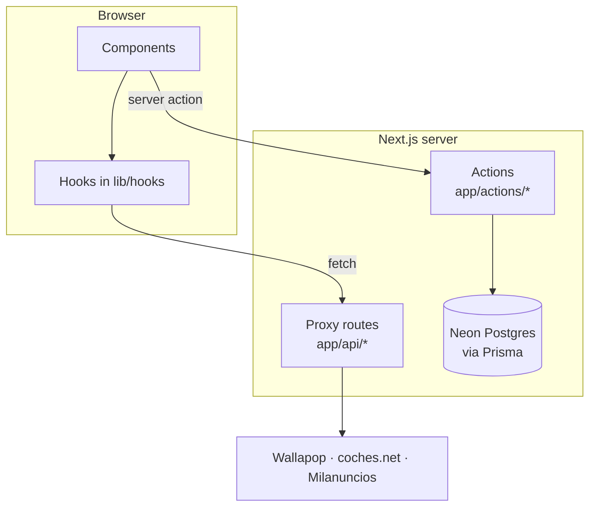
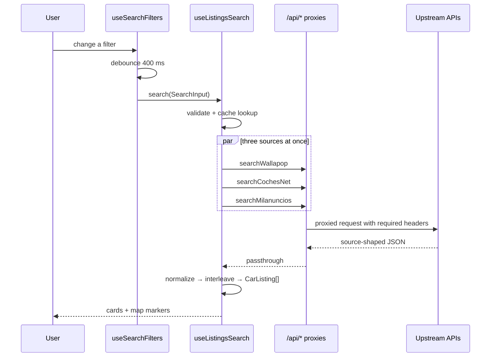
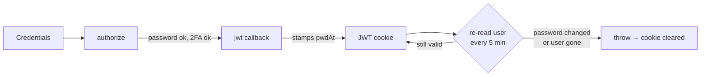
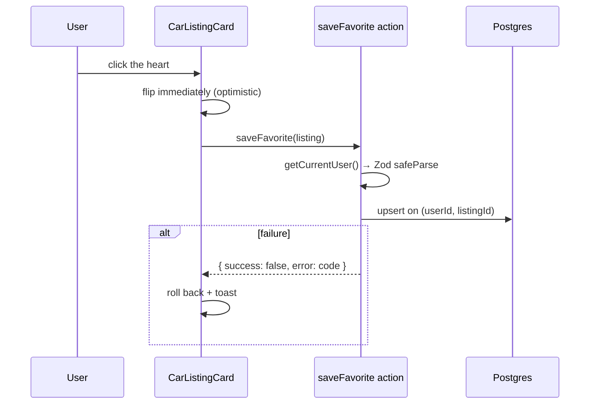

# Architecture

The system in one read. Three request paths traced end to end, then the patterns
that apply everywhere.

Behaviour guarantees are not here — they live in [`specs/`](specs/README.md) and
are enforced by `pnpm spec:check`. This document explains how the pieces fit,
which no single spec owns.

## The shape

A Next.js 16 App Router application. There is no separate backend: server
components, server actions and route handlers all run in the same deployment.

Two rules fall out of that picture and explain most of the code:

- **Components never call `fetch`.** Request lifecycles live in `lib/hooks/*`,
  which call clients in `lib/<source>/*`. A component consumes a hook.
- **Mutations are server actions; route handlers are only for proxying.**
  Anything writing to the database is an action in `app/actions/`. The `app/api/`
  routes exist because the upstream marketplaces cannot be called from a browser.

## Path 1 — a search

The core of the product, and the only path that fans out.

**Filters.** [`lib/hooks/useSearchFilters.ts`](../lib/hooks/useSearchFilters.ts)
holds every filter in one `FilterValues` object and exposes a typed setter per
field. Each setter funnels into `update()`, which patches state and **debounces
the search by 400 ms** — filters re-search as you touch them, so without the
debounce a drag on a range slider would fire a dozen fan-outs.

Two deliberate asymmetries:

- `triggerSearch()` (the search button) searches immediately **and collapses the
  filter panel**. `update()` does not collapse it — closing the panel out from
  under someone still adjusting filters would be hostile.
- `setBrand` also clears `model`. A model id only means anything under its brand.

On mount the hook fires an immediate search using the Spain-centre fallback,
starts browser geolocation, and re-searches when geolocation resolves — but only
if the user has not meanwhile picked an explicit location. Doing it in that order
is what stops the first paint waiting on a permission prompt.

**Fan-out.** [`lib/hooks/useListingsSearch.ts`](../lib/hooks/useListingsSearch.ts)
validates the params with `searchSchema`, checks a 60-second in-memory cache
(`lib/wallapop/cache.ts`, keyed by the JSON-stringified params), then calls all
three sources under `Promise.allSettled`.

**Partial failure is the normal case.** Only if *all three* reject does the user
see an error; otherwise the survivors render. Three reverse-engineered upstreams
means one being unavailable is a Tuesday, not an outage.

Results are merged **round-robin**, not concatenated, so every source appears
near the top instead of whichever returned most dominating the first screen.

**The merge enforces the filters upstream cannot.** Only Wallapop honours the
radius on its side, and only the structured sources honour the model, so the
merged list is post-filtered: with a location chosen, listings outside the
radius — or pinned at the country-centre fallback — are dropped
(`lib/geo/radius.ts`), and with a model selected, listings naming it neither
in their model field nor their title are dropped. The behaviour is owned by
MAP-16..18 in [`specs/map-and-search.md`](specs/map-and-search.md); removing
the post-filter reverts coches.net and Milanuncios to nationwide results.

**Out-of-order responses.** Every call to `search()` increments
`searchVersionRef`, and the result is discarded if the version moved on while it
was in flight. With a 400 ms debounce and three sources of differing latency, a
slow earlier search would otherwise overwrite a fast later one.

**Pagination is per-source**, because the three APIs page differently: Wallapop
returns a `next_page` cursor, the other two take page numbers with a total. The
sentinel calls `loadMore()`, which only re-requests sources that still have more.
`loadMore` is not part of the hook's public surface — it fires from an
`IntersectionObserver` attached via `sentinelRef`, which is also how it has to be
tested.

Because the post-filter above can empty a page, fetching a page and growing the
list are no longer the same event, and both the first search and `loadMore`
keep fetching rounds until one yields a listing or every source is exhausted.
Removing that loop reintroduces a dead end rather than merely a short page —
the reasoning is MAP-19's, in
[`specs/map-and-search.md`](specs/map-and-search.md).

**One shared filter set drives all three sources.** The UI builds a single
`SearchInput`; each client translates it into that API's parameters. There is no
per-source filter UI, and adding one would be the wrong shape — see
[`specs/data-sources.md`](specs/data-sources.md).

## Path 2 — sign-in and revocation

NextAuth 4 with JWT sessions. The interesting part is not signing in; it is
signing *out* a session you cannot delete.

A JWT lives in the browser and cannot be revoked server-side, so
`User.passwordChangedAt` acts as a **revocation clock**. The `jwt` callback
stamps `pwdAt` at sign-in and re-reads the row at most every five minutes. If the
password changed after the stamp — or the account no longer exists — it
**throws**, which NextAuth's session route catches, clearing the cookie and
nulling the session. Any flow that changes a password must bump
`passwordChangedAt`, or it does not sign anyone out.

**`proxy.ts` is UX, not authorization.** Next 16 renamed the `middleware` file
convention to `proxy`. It decodes and signature-checks the JWT, which is enough
to redirect a signed-out visitor away from `/account` or `/favorites` — but it
does **not** run the `jwt` callback, so it cannot see revocations. Every server
action independently calls `getCurrentUser()` from
[`lib/auth/session.ts`](../lib/auth/session.ts), which does.

**Never call `getServerSession` directly.** `getCurrentUser()` is the only
authorization check that honours revocation.

The rest — password policy, enumeration resistance, 2FA, email flows — is
specified in [`specs/auth-email-and-oauth.md`](specs/auth-email-and-oauth.md).

## Path 3 — a favorite

The one path that writes, and the template for future mutations.

[`app/actions/favorites.ts`](../app/actions/favorites.ts) is the shape every
server action follows:

1. `getCurrentUser()` **first** — before validation, before any query.
2. Zod `safeParse` on the input.
3. Return `{ success, error?: Code }` where the error is a **code**, never prose.
4. Catch and map failures to `unexpected`; never leak the exception.

Three decisions in there worth knowing, each with a reason that is not obvious
from the code:

- **`upsert` with `update: {}`.** Saving is a toggle, so a second click on an
  already-saved listing is an ordinary event rather than an error to recover
  from. The empty update deliberately leaves the original snapshot alone —
  re-saving is not a refresh, and silently rewriting the stored price would make
  staleness harder to reason about, not easier.
- **`removeFavorite` reports success even when nothing matched.** The caller
  asked for the listing not to be saved, and it is not saved. Distinguishing
  "removed" from "was never yours" would confirm that someone else's favorite
  exists.
- **Favorites store a full snapshot, not a reference.** No source client can
  fetch a single listing by id, so a reference-only favorite would have nothing
  to render. The trade-off — the snapshot goes stale — is argued in
  [`specs/favorites.md`](specs/favorites.md).

**Reconciliation.** The sources know nothing about this user, so the saved set is
joined on the client: `useFavorites` fetches the saved ids once per session and
`MapView` passes `isFavorite` into every card. This was a real bug — cards
rendered without the prop, so a saved car came back from a search looking
unsaved, while the component test passed because it supplied a prop the
application never did.

## Patterns that apply everywhere

**No data-fetching library.** There is no TanStack Query, SWR or Redux, and
adding one is a decision to raise rather than make. Hooks own their own request
lifecycle, including the out-of-order guard.

**Errors are codes, not messages.** Server code cannot read the client i18n
context and the default locale is Spanish, so actions and Zod schemas return
codes (`AUTH_ERROR`, `FAVORITE_ERROR`). Forms resolve them through
[`lib/i18n/errors.ts`](../lib/i18n/errors.ts) at render. When calling `setError`,
pass the raw code.

**Failures surface as toasts**, not inline error text — except field-level
validation, which is inline and focuses the first error.

**Configuration is validated at boot.** [`lib/env.ts`](../lib/env.ts) parses
`process.env` with Zod at import time and throws with a readable message. Two
variables are required; everything else disables a feature rather than blocking
startup.

**Everything user-facing goes through `t.*` keys** in both locales. No hardcoded
Spanish or English in components.

## Directory map

| Path | Holds |
| --- | --- |
| `app/` | Routes, layouts, server actions, proxy route handlers |
| `app/actions/` | Server actions — every mutation |
| `app/api/` | Proxy route handlers for the three upstreams, plus the alert cron endpoint |
| `components/map/` | The search + map feature |
| `lib/alerts/` | The background poller's own source fan-out and unsubscribe tokens |
| `components/ui/` | Radix-wrapped primitives |
| `lib/hooks/` | Every request lifecycle |
| `lib/wallapop/`, `lib/cochesnet/`, `lib/milanuncios/` | One module per source: client, normalize, taxonomy |
| `lib/auth/` | Session, password policy, tokens, two-factor |
| `lib/i18n/` | Locale resolution, translations, error-code copy |
| `lib/geo/` | Static cities, Nominatim geocoding, browser geolocation |
| `lib/validations/` | Zod schemas with exported inferred types |
| `interfaces/` | Reusable typings — `CarListing`, `SelectedLocation`, `AlertSummary` |
| `scripts/` | Dependency-free tooling: branch databases, spec and docs checks |

`app/generated/prisma/` is generated and gitignored. `lib/mock/` is dead — do not
wire anything new to it.

## Path 4 — a poll with no user in it

The three paths above all begin with a request. Alerts do not: a GitHub Actions
cron POSTs to `app/api/alerts/run/route.ts`, which claims work off a Postgres
queue and drains it. Two consequences reshape the rules above rather than
following them.

**It cannot use `lib/*/client.ts`.** Those resolve their URL against
`window.location.origin` and call the proxy routes — which is precisely what the
proxies are for. A cron has neither, so `lib/alerts/search.ts` calls the three
upstreams directly with the same headers the proxies send.

**It cannot use `getCurrentUser()`.** The caller is a machine, so the endpoint
authenticates with a shared secret in constant time. This is the one place the
"prefer server actions, route handlers only for proxying" rule does not apply,
because there is no session and no browser to run an action from.

Everything else it needs — locale for the email, the listing snapshot — is read
from the database, because there is no request context to infer it from. Full
behaviour in [`specs/alerts.md`](specs/alerts.md); the scheduling choice and what
it beat in [`decisions/0006-alert-scheduling.md`](decisions/0006-alert-scheduling.md).

## See also

- [Data sources](specs/data-sources.md) — what each upstream guarantees
- [Favorites](specs/favorites.md) — the write path in full
- [Car alerts](specs/alerts.md) — the background path, the queue, the freshness budget
- [Auth, email and OAuth](specs/auth-email-and-oauth.md) — the security model
- [Getting started](getting-started.md) — running any of this locally
