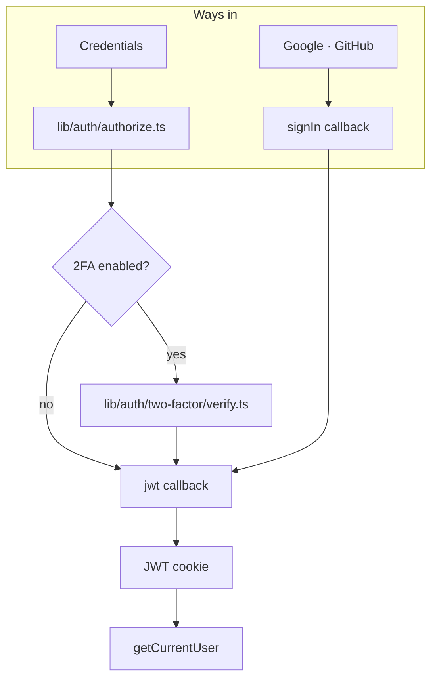

# Authentication — orientation

**This page is deliberately one page.**
[`specs/auth-email-and-oauth.md`](specs/auth-email-and-oauth.md) already covers
authentication in 247 rationale-dense lines and is enforced by `spec:check`.
Writing a second, unenforced account of the same system is the most likely way
this documentation ends up confidently wrong.

So: the map, the threat model in a paragraph, and where to read next. **If this
file grows past a page, delete it and link the spec directly.**

## The pieces

| Area | Lives in |
| --- | --- |
| NextAuth config, callbacks, providers | `lib/auth/options.ts` |
| Credentials verification | `lib/auth/authorize.ts` |
| The only authorization check | `lib/auth/session.ts` — `getCurrentUser()` |
| Password rules | `lib/auth/password-policy.ts`, `password-strength.ts`, `pwned.ts` |
| Hashing | `lib/auth/hash.ts` — bcryptjs, 12 rounds |
| Tokens | `lib/auth/tokens.ts` — SHA-256, single-use |
| TOTP | `lib/auth/two-factor/` — built on `node:crypto`, no dependency |
| Rate limiting | `lib/rate-limit.ts` — Postgres-backed |
| Route redirects | `proxy.ts` |
| Email | `lib/email/` — Resend over `fetch` |

## The threat model in a paragraph

The account is worth taking, so every surface is **enumeration-resistant**:
identical responses whether or not an address exists, bcrypt run *before* any
existence check so timing cannot substitute for the message, and registration
that writes a `PendingRegistration` rather than a `User` until the inbox is
proven. Passwords are gated by length and blocklists rather than composition
rules (NIST SP 800-63B), with the breach check **failing open** so an outage
cannot block signups. Sessions are stateless JWTs, so revocation runs off a
`passwordChangedAt` clock re-read every five minutes. TOTP secrets are
*encrypted*, not hashed, because verification recomputes the HMAC — which means
`TWO_FACTOR_ENCRYPTION_KEY` is the thing a database leak alone does not give up.

## Five rules that are easy to break

These are the ones where a plausible-looking change quietly removes a defence.

1. **Never call `getServerSession` directly** — use `getCurrentUser()`. Only it
   honours revocation. `proxy.ts` decodes the JWT but never runs the `jwt`
   callback, so it is UX, not authorization.
2. **Any flow that changes a password must bump `passwordChangedAt`**, or it
   signs nobody out.
3. **Password reset must not bypass 2FA.** If it did, control of the mailbox
   would defeat the second factor entirely. That is what recovery codes are for.
4. **The email-change confirmation link goes to the *new* address**, never the
   current one, and the current password is required to start the change. Either
   alone is insufficient.
5. **Return error codes, never prose.** Server code cannot read the client i18n
   context and the default locale is Spanish.

## Read next

| For | Go to |
| --- | --- |
| Everything: policy, flows, 2FA, OAuth linking, enumeration | [`specs/auth-email-and-oauth.md`](specs/auth-email-and-oauth.md) |
| What the token tables defend against | [data-model.md](data-model.md#auth-tokens) |
| Sign-in and revocation as a request path | [architecture.md](architecture.md#path-2--sign-in-and-revocation) |
| Configuring email, OAuth and 2FA | [operations.md](operations.md#environment-variables) |
| Lockouts and undelivered email | [operations.md](operations.md#runbooks) |
