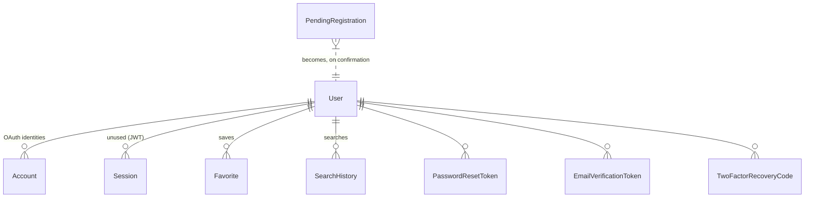

# Data model

Eleven models in [`prisma/schema.prisma`](../prisma/schema.prisma), on Neon
Postgres, reached through Prisma 7's `@prisma/adapter-pg` driver adapter.

Two things are **not** modelled and should not be assumed: normalised `Car`
listing storage and `SavedSearch`. Listings are fetched live on every search and
persisted only as favorite snapshots.

## The models



### User

The account. `password` is **nullable** — OAuth-only accounts never set one, so
credentials login must guard on it (`lib/auth/authorize.ts`).

`image`, not `avatarUrl`: the NextAuth Prisma adapter writes the OAuth profile
picture to that exact field name, and renaming it breaks linking silently.

Four fields exist purely to make security properties work:

| Field | Job |
| --- | --- |
| `passwordChangedAt` | The **revocation clock**. Bumped on every password change; the JWT callback compares against it and refuses older tokens. This is how "sign out everywhere" works without server-side sessions |
| `twoFactorSecret` | AES-256-GCM ciphertext, **not a hash** — verifying a TOTP code means recomputing the HMAC, so the secret must be recoverable. The key is `TWO_FACTOR_ENCRYPTION_KEY`, so the database alone is not enough |
| `twoFactorEnabledAt` | Null while enrolment is half-finished. **Only this field gates login**, which is what stops a user locking themselves out mid-setup |
| `twoFactorLastStep` | Highest accepted TOTP counter step. Anything at or below it is refused, so a code read over a shoulder cannot be replayed inside its own 30-second window |

### Favorite

A saved listing, stored as a **full snapshot** of `CarListing` rather than a
reference. Fourteen denormalised columns: `source`, `title`, `subtitle`, `image`,
`brand`, `model`, `location`, `fuel`, `url`, `price`, `mileage`, `year`, `lat`,
`lng`.

That looks wrong until you know that no source client can fetch a single listing
by id — all three expose search only — so a `(source, listingId)` row would have
nothing to render. The trade-off, and the alternative it beat, is argued in
[`specs/favorites.md`](specs/favorites.md).

`listingId` is the normalised, source-prefixed id (`wallapop-abc123`), already
unique across sources, so no separate source column is needed as a key.

`@@unique([userId, listingId])` is what makes "saving twice leaves one row" true
**in the database** rather than in a read-then-write race in application code —
the control is a toggle a user can click twice in a second.

### Auth tokens

Three token tables, all following the same rule: **the raw token is never
stored.** Only a SHA-256 digest, so a database leak does not hand an attacker
working links.

| Model | Backs |
| --- | --- |
| `PasswordResetToken` | `/forgot-password` → `/reset-password?token=` |
| `EmailVerificationToken` | `newEmail == null` confirms the current address; `newEmail != null` moves the account to that address on redemption |
| `PendingRegistration` | A submitted-but-unconfirmed signup |

All are single-use via `usedAt` and expire via `expiresAt`.

**`PendingRegistration` is the one that matters most.** No `User` row exists until
someone proves control of the address, which is what lets the signup form answer
"check your inbox" identically whether or not the email is already taken. It
holds the bcrypt hash, never the plaintext, so confirmation does not have to ask
for the password again.

### TwoFactorRecoveryCode

SHA-256, not bcrypt. The codes carry ~73 bits of entropy so there is no
dictionary to grind, and a unique index makes redemption one indexed lookup
instead of ten slow comparisons.

They exist because password reset deliberately does **not** bypass 2FA — if it
did, control of the mailbox would defeat the second factor entirely — so without
recovery codes a lost phone is a lost account.

### RateLimit

Fixed-window counters, keyed by `key`. In Postgres rather than memory because
Vercel runs each request on a possibly-cold instance, so an in-process `Map`
would reset constantly and limit nothing.

### Adapter-required models

`Account`, `Session` and `VerificationToken` exist because
`@next-auth/prisma-adapter` requires them.

**`Session` is dead while the strategy is JWT** — nothing writes to it — but the
adapter's type contract needs the model to exist. `VerificationToken` is likewise
the adapter's own magic-link table, distinct from our `EmailVerificationToken`.

### SearchHistory

`userId`, `query`, `createdAt`. Present but not yet surfaced anywhere.

## Cascades

Every user-owned model uses `onDelete: Cascade`, so deleting a `User` removes
their favorites, tokens, recovery codes, OAuth links and search history.

This is a **schema property enforced by Postgres, not by application code**, and
no Vitest test in this repo can prove it — Prisma is mocked, so a test would only
assert that Prisma was called with the right arguments. It is verified by review
and by the database-backed e2e suite.

## Migrations

Standard Prisma, with one project-specific rule that is not optional.

### Run `pnpm db:branch` first, from any worktree

`prisma migrate dev` assumes the dev database matches the **current branch's**
migration history. While worktrees share one database, a migration applied from
any one of them makes every other worktree report "applied to the database but
missing from the local migrations directory" — and the only remedy Prisma offers
is a reset that drops every row.

The database holds real accounts and there is no seed script.

**Never run `prisma migrate reset`, `db push --force-reset`, or anything that
drops the database.** Prisma offers it for bookkeeping problems that do not need
it. Treat the offer as a bug report, not an instruction.

`scripts/require-branch-db.mjs` enforces this rather than trusting anyone to
remember — see [Getting started](getting-started.md#refusing-to-run).

### Two traps

- **`prisma migrate status` does not catch drift.** It reported "Database schema
  is up to date!" against a stale checksum *and* a migration missing locally. It
  validates neither. Only `migrate dev` does.
- **Checksums are SHA-256 of `migration.sql` with CRLF normalised to LF.**
  `core.autocrlf=true` is set with no `.gitattributes`, so every migration file
  is CRLF on disk and LF in git. That is **not** a source of drift. Do not chase
  it.

### Repairing a stale checksum

```sql
UPDATE _prisma_migrations SET checksum = … WHERE migration_name = …
```

Never a reset. Confirm the file is semantically correct first: if `migrate dev`'s
drift summary shows no differences attributable to that migration, Prisma already
replayed it on a shadow database and it matched.

## See also

- [Getting started](getting-started.md) — branch databases and the bootstrap
- [Favorites](specs/favorites.md) — why the snapshot, and what it costs
- [Auth, email and OAuth](specs/auth-email-and-oauth.md) — what the token tables
  are defending against
